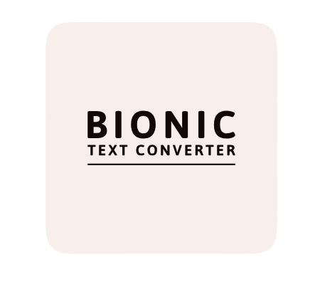

<a name="readme-top"></a>

[![Forks][forks-shield]][forks-url]
[![Stargazers][stars-shield]][stars-url]
[![Issues][issues-shield]][issues-url]
[![MIT License][license-shield]][license-url]

<!-- PROJECT LOGO -->
<br />
<div align="center">
  <a href="https://github.com/dchan04/BionicReader">
    
  </a>

<h3 align="center">Bionic Text Converter</h3>

  <p align="center">
    A convenient tool to convert text into Bionic Text for faster reading.
    <br />
    <a href="https://dchan04.github.io/BionicReader/">View Demo</a>
  </p>
</div>

<!-- TABLE OF CONTENTS -->
<details>
  <summary>Table of Contents</summary>
  <ol>
    <li><a href="#about-the-project">About The Project</a></li>
    <li><a href="#screenshots">Screenshots</a></li>
    <li><a href="#technologies">Technologies</a></li>
    <li><a href="#prerequisites">Prerequisites</a></li>
    <li><a href="#installation">Installation</a></li>
    <li><a href="#roadmap">Roadmap</a></li>
    <li><a href="#contact">Contact</a></li>
    <li><a href="#license">License</a></li>
  </ol>
</details>

<!-- ABOUT THE PROJECT -->

## About the Project

The Bionic Text Converter is a user-friendly tool
that extracts text from PDF, TXT, and DOCX files and
converts it into bionic text.

Bionic reading is a new innovative method of reading used to improve reading speed. By guiding the eyes through the text with artificial fixation points, the reader focuses on the highlighted initial letters and lets the brain complete the word.

Although the benefits are not guaranteed, many people with dyslexia and ADHD have shared positive experiences on social media like improved focus.

## Screenshots

### Main Page

[![Home page][homepage]](https://dchan04.github.io/BionicReader/)

### Example Generated PDF

[![Table][table]](https://github.com/dchan04/BionicReader/images/ExampleOutput.pdf)

<!-- Built with  -->

### Technologies

-   [![React][React.js]][React-url]
-   [![Bootstrap][Bootstrap.com]][Bootstrap-url]
-   ![NodeJS][Node.js]
-   [![HTML][HTML.com]][HTML-url]
-   [![CSS][CSS.com]][CSS-url]
-   [![Javascript][Javascript.com]][Javascript-url]

<p align="right">(<a href="#readme-top">back to top</a>)</p>

## Prerequisites

-   npm
    ```sh
    npm install npm@latest -g
    ```

## Installation

1. Clone the repo
    ```sh
    git clone https://github.com/dchan04/BionicReader.git
    ```
2. Install NPM packages
    ```sh
    npm install
    ```

<p align="right">(<a href="#readme-top">back to top</a>)</p>

<!-- ROADMAP -->

## Roadmap

-   [ ] Add more file compatibility for import
    -   [ ] Rich Text Format (.rtf)
    -   [ ] Spanish
-   [ ] Add more download options
    -   [ ] E-Book file format (.epub)
    -   [ ] Word Document (.docx)
    -   [ ] Plain Text (.txt)

See the [open issues](https://github.com/dchan04/BionicReader/issues) for a full list of proposed features (and known issues).

<p align="right">(<a href="#readme-top">back to top</a>)</p>

<!-- CONTACT -->

## Contact

Darren Chan - darrenchan1123@gmail.com

Project Link: [https://github.com/dchan04/BionicReader](https://github.com/dchan04/BionicReader)

<p align="right">(<a href="#readme-top">back to top</a>)</p>
<!-- LICENSE -->

## License

Distributed under the MIT License. See `LICENSE.txt` for more information.

<p align="right">(<a href="#readme-top">back to top</a>)</p>

<!-- MARKDOWN LINKS & IMAGES -->
<!-- https://www.markdownguide.org/basic-syntax/#reference-style-links -->

[contributors-shield]: https://img.shields.io/github/contributors/dchan04/BionicReader.svg?style=for-the-badge
[contributors-url]: https://github.com/dchan04/BionicReader/graphs/contributors
[forks-shield]: https://img.shields.io/github/forks/dchan04/BionicReader.svg?style=for-the-badge
[forks-url]: https://github.com/dchan04/BionicReader/network/members
[stars-shield]: https://img.shields.io/github/stars/dchan04/BionicReader.svg?style=for-the-badge
[stars-url]: https://github.com/dchan04/BionicReader/stargazers
[issues-shield]: https://img.shields.io/github/issues/dchan04/BionicReader.svg?style=for-the-badge
[issues-url]: https://github.com/dchan04/BionicReader/issues
[license-shield]: https://img.shields.io/github/license/dchan04/BionicReader.svg?style=for-the-badge
[license-url]: https://github.com/dchan04/BionicReader/blob/master/LICENSE.txt
[linkedin-shield]: https://img.shields.io/badge/-LinkedIn-black.svg?style=for-the-badge&logo=linkedin&colorB=555
[linkedin-url]: https://linkedin.com/in/linkedin_username
[homepage]: images/screenshot1.PNG
[table]: images/screenshot2.PNG
[nested-table]: images/screenshot3.PNG
[Next.js]: https://img.shields.io/badge/next.js-000000?style=for-the-badge&logo=nextdotjs&logoColor=white
[Next-url]: https://nextjs.org/
[React.js]: https://img.shields.io/badge/React-20232A?style=for-the-badge&logo=react&logoColor=61DAFB
[React-url]: https://reactjs.org/
[Vue.js]: https://img.shields.io/badge/Vue.js-35495E?style=for-the-badge&logo=vuedotjs&logoColor=4FC08D
[Bootstrap.com]: https://img.shields.io/badge/Bootstrap-563D7C?style=for-the-badge&logo=bootstrap&logoColor=white
[Bootstrap-url]: https://getbootstrap.com
[Javascript.com]: https://img.shields.io/badge/JavaScript-323330?style=for-the-badge&logo=javascript&logoColor=F7DF1E
[Javascript-url]: https://Javascript.com
[HTML.com]: https://img.shields.io/badge/HTML5-E34F26?style=for-the-badge&logo=html5&logoColor=white
[HTML-url]: https://html.com/
[CSS.com]: https://img.shields.io/badge/CSS3-1572B6?style=for-the-badge&logo=css3&logoColor=white
[CSS-url]: https://css.com/
[SQLite.com]: https://img.shields.io/badge/sqlite-%2307405e.svg?style=for-the-badge&logo=sqlite&logoColor=white
[SQLite-url]: https://www.sqlite.org/index.html
[ASP.Net]: https://img.shields.io/badge/.NET-5C2D91?style=for-the-badge&logo=.net&logoColor=white
[Node.js]: https://img.shields.io/badge/node.js-6DA55F?style=for-the-badge&logo=node.js&logoColor=white
